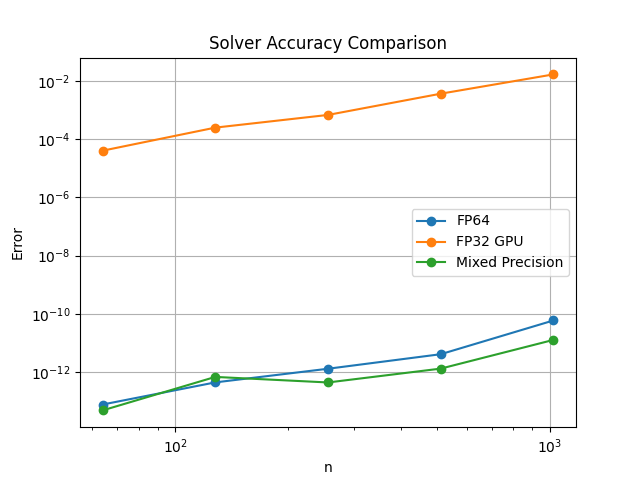

# Mixed-Precision Iterative Refinement Solver (GPU)

[](https://olebo.github.io/mixed-precision-iterative-refinement-gpu/) 
[](https://github.com/OleBo/mixed-precision-iterative-refinement-gpu/actions/workflows/build.yml)


A portfolio-grade GPU project demonstrating numerical maturity, mixed-precision design, and performance-aware implementation.

## Overview

This repository implements a solver for dense linear systems `Ax = b` using:

- low precision matrix factorization and solve (`FP16` / `FP32`)
- high precision residual computation and update (`FP64`)
- iterative refinement to recover `FP64`-level accuracy

The goal is to show that low precision compute can be used for speed, while high precision correction restores correctness.

## Why this project matters

This is not a toy. It is a signal of:

- algorithmic thinking
- numerical stability awareness
- GPU performance engineering
- comparison between low precision and mixed precision

## Architecture

Precision split:

- Matrix factorization: `FP16` or `FP32`
- Solve step: `FP16` / `FP32`
- Residual computation: `FP64`
- Update: `FP64`

## Result

<p align="center">
  
  <br>
  <em>Figure 1: Comparison of numerical error across different solvers. The FP32 GPU implementation (using cusolverDnSgetrf) provides a fast initial estimate, while the Mixed Precision Iterative Refinement approach successfully regains double-precision accuracy (10^{-12}), matching or exceeding standard FP64 performance.</em>
</p>


## 🛠 Workflow Management

This project uses a Makefile to automate CUDA compilation via CMake and manage experiment workflows. All logs, including compilation outputs and script execution details, are captured in workflow.log.

### Prerequisites

* CMake (v3.10+)
* CUDA Toolkit (for nvcc)
* Python 3 with required dependencies

### Available Commands

| Command | Description |
|---|---|
| make | Runs all workflows in sequence (Baseline → Standard → Full). |
| make workflow_baseline | Runs Python-based baseline tests on 128x128 Random and Hilbert matrices. |
| make workflow_standard | Executes the sequential pipeline (Run experiments → Aggregate → Plot). |
| make workflow_full | Primary Target. Compiles the CUDA library via CMake and runs full-scale experiments. |
| make clean | Deletes the build/ directory and resets workflow.log. |

### Automated CUDA Build

The workflow_full target manages the CMake lifecycle automatically:
1. **Configuration:** Initializes the build/ directory and runs cmake ...
2. **Compilation:** Builds libmixed_precision_lib.so using cmake --build.
3. **Verification:** Performs an immediate symbol check (nm) to ensure gpuSolve and refineSolution are properly exported before the experiments begin.

## 🐳 Running with Docker

This project uses a multi-stage Docker build to compile the CUDA solver and execute the experiment pipeline in a lightweight runtime environment.

1. Build the Image
  
    From the project root, build the Docker image:
```bash
docker build -t mixed-precision-solver .
```
2. Run the Workflow

    Execute the following command to run all experiments. This command uses volume mounts to ensure your logs and plots are saved to your local machine:
```bash
docker run --gpus all \
    -v $(pwd)/results:/app/results \
    -v $(pwd)/workflow.log:/app/workflow.log \
    mixed-precision-solver
```
**Requirement:** You must have the NVIDIA Container Toolkit installed on your host to use GPU acceleration.

Or use Docker Compose:

```bash
# Build and start the container
docker-compose up -d

# Execute commands
docker-compose exec mixed-precision-solver bash
```

## 🚀 Running from GitHub Container Registry (GHCR)

If you don't want to build the image locally, you can pull the pre-compiled version directly from GHCR.

1. Pull the Image
```bash
docker pull ghcr.io/olebo/mixed-precision-iterative-refinement-gpu:latest
```
2. Run Experiments

    Use the following command to execute the workflow. This will use your local GPU and save all generated plots/logs to your current directory:
```bash
docker run --gpus all \
    -v $(pwd)/results:/app/results \
    -v $(pwd)/workflow.log:/app/workflow.log \
    ghcr.io/olebo/mixed-precision-iterative-refinement-gpu:latest
```


## 🛠 CI/CD Integration

The image is automatically rebuilt and pushed to GHCR on every push to the main branch. This ensures that:
- The CUDA Solver is always compiled with the latest source code.
- The Python environment and dependencies are pre-configured and tested.
- The Runtime image remains lightweight by excluding the heavy CUDA development toolkit.

- **Workflow**: `.github/workflows/build.yml`
- **Triggers**: Push to `main`/`develop` branches and pull requests
- **Jobs**:
  - Build Docker image and push to GitHub Container Registry (GHCR)
  - Run solver in container to verify functionality
  - Cache Docker layers for faster builds

View workflow runs in the [Actions](./../../actions) tab.

## GitHub Pages

This repository includes GitHub Pages [documentation](https://olebo.github.io/mixed-precision-iterative-refinement-gpu) served from `docs/`.
